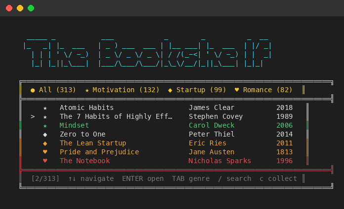
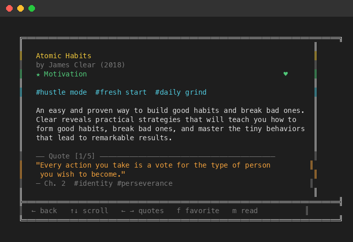
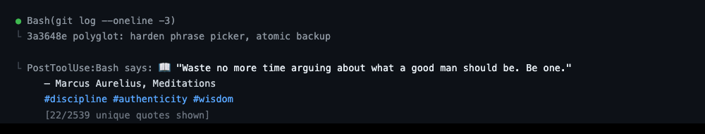

# Bookshelf

Bookshelf puts a quiet, perspective-widening book quote inside your Codex or
Claude Code session every few completed turns. Instead of staring at terminal
churn while an agent works, you get one small literary reset—selected locally,
without sending your prompts, code, or transcript anywhere.

It also includes a full terminal library, reading lists, search, and on-demand
relevant quotes. Those are the library behind the ambient moment, not the main
event. Shipped totals come from the catalog: see [catalog counts](docs/catalog-counts.md).

[Visit the Bookshelf landing page](https://pagecast-6cv.pages.dev/p/endlessly-brooding-cavern-29bf971e4f06b37e880793b556d0a682/).



## The ambient experience

Ambient mode is optional and off by default:

```bash
bookshelf ambient enable --cadence 5 --intent refactor
bookshelf ambient status
bookshelf ambient disable
```

Installing an agent integration does not enable ambient mode. Adapters contain
their own errors, but Bookshelf does not make an absolute claim about any host
turn.

For deliberate use, invoke the Bookshelf skill or run `bookshelf quote`,
`bookshelf quote --intent refactor`, or `bookshelf feedback up|down`.

## Relevance and privacy

`bookshelf quote --intent refactor` is the explicit on-demand path. Ambient
`Stop` hooks use the equally explicit theme saved by `ambient enable --intent`;
they do not pretend a completed-turn event contains task context. Both paths
map an allow-listed intent to local tags. Neither reads commands, paths,
prompts, transcripts, code, tool arguments, model output, or makes a network
call. Ambient delivery is optional, off by default, and fails closed when a
safe bounded quote is unavailable.

Relevant alternatives rotate before repeats inside a 50-quote recent window.
Ambient lines are capped at 220 UTF-8 bytes and 32 whitespace-delimited words;
the explicit on-demand command retains its wider compact-display budget.

The versioned 176-case evaluation is an authored regression contract for that
intent-to-tag mapping and the deterministic ranker. Its precision metrics catch
ranking drift; they are not a human-rated claim of literary or semantic
relevance.

## Install

Bookshelf requires Python 3.10 or newer and has no runtime dependencies.

```bash
pipx install git+https://github.com/Amal-David/bookshelf.git
# After the first PyPI release:
# pipx install ambient-bookshelf
```

Then run `bookshelf` to open the interactive library.

### Codex Desktop and CLI

```bash
codex plugin marketplace add Amal-David/bookshelf
codex plugin add bookshelf@bookshelf
```

Bookshelf is packaged as a Codex plugin with a skill and a fail-soft `Stop`
hook. Codex shares plugin configuration across its app and CLI surfaces; the
hook returns a compact `systemMessage` when the local cadence is due.

### Claude Code

Run these inside Claude Code:

```text
/plugin marketplace add Amal-David/bookshelf
/plugin install bookshelf@bookshelf
```

The marketplace validates strictly with Claude Code 2.1.212 and declares the
same optional `Stop` cadence used by the Codex integration.

### Pi

```bash
pi install git:github.com/Amal-David/bookshelf
```

Pi 0.57 installs and lists the canonical skill plus its `agent_end` extension
from an isolated home. A live native notification is not claimed.

### Hermes

```bash
hermes plugins install Amal-David/bookshelf --enable
```

Hermes 0.16 installs and loads Bookshelf from a clean working directory,
registering the canonical skill plus its `transform_llm_output` hook. A live
authenticated turn and appended output are not claimed.

Bookshelf validates install, manifest, loader, and adapter behavior at the
strongest locally available boundary for Codex, Claude Code, Pi, and Hermes.

The Codex and Claude hooks resolve their own installed plugin roots, and the
skill's `scripts/quote.py` wrapper resolves the bundled Python package relative
to itself; neither requires a globally installed `bookshelf` command. The old
manual `bookshelf/skill/hook.py` and `codex_notify.py` paths are compatibility
adapters only and are deprecated for new installs.

`protocol/ambient-companion-v1.schema.json` and its example are shipped as
inert protocol data for integrators. Bookshelf does not import them at runtime
and ambient delivery never makes network requests.

## Library

The [generated catalog counts](docs/catalog-counts.md) distinguish catalogued
books from works referenced by quotes. Legacy records are explicitly marked
`legacy-unverified`; 585 primary-source-linked v2 records remain pending human
review and retain their repository link, source locator, extraction-snapshot
digest, excerpt digest, rights, and review-pending metadata. Those source links
were not pinned to immutable commits, so the v2 records must not be described
as source-verified.
Quotes carry context tags used to prefer relevant entries for work such as
debugging, building, reviewing, or shipping. This is not a claim that all
quotes are verified or curated.
See [DATA.md](DATA.md) for provenance and the correction policy.

## Terminal library

```bash
bookshelf
```



| Key | Action |
|---|---|
| `Up` / `Down` / `j` / `k` | Navigate |
| `Enter` / `Right` | Open a book |
| `Tab` / `Shift+Tab` | Cycle genres |
| `/` | Search |
| `c` | Open reading lists |
| `r` | Pick a random book |
| `f` | Toggle favorite |
| `m` | Mark as read |
| `w` | Add to want-to-read |
| `?` | Show help |
| `q` | Go back or quit |

Favorites, reading lists, statistics, hook counters, and ambient settings remain
local under the platform application-data directory named `bookshelf`.

## Demo video



[Watch the real five-turn CLI Stop-hook demo on the live landing page](https://pagecast-6cv.pages.dev/p/endlessly-brooding-cavern-29bf971e4f06b37e880793b556d0a682/#demo).

The recording invokes the same packaged hook path used by Codex and Claude
Code. It intentionally shows only the CLI behavior: four quiet stops, then one
compact quote on the fifth.

The landing-page source lives in [`site/`](site/). It is built from the same
forest, paper, and rose visual system as the demo.

## Development

```bash
python3 -m unittest discover -s tests -v
python3 -m compileall -q bookshelf hooks scripts tests
python3 -m pip wheel . --no-deps --no-build-isolation --wheel-dir dist
```

See [CONTRIBUTING.md](CONTRIBUTING.md) for catalog corrections and code
contributions.

## License

The application code is MIT licensed. Book titles, author names, summaries, and
quoted text have separate provenance and rights considerations described in
[DATA.md](DATA.md).
